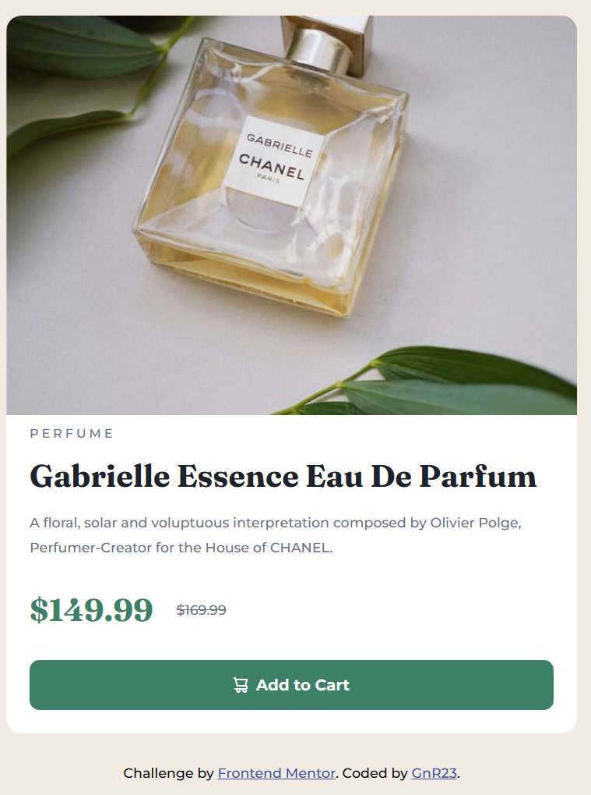

# Frontend Mentor - 7- Product preview card component challenge

This is a solution to the [Product preview card component challenge on Frontend Mentor](https://www.frontendmentor.io/challenges/product-preview-card-component-GO7UmttRfa). Frontend Mentor challenges help you improve your coding skills by building realistic projects. 

## Table of contents

- [Overview](#overview)
  - [The challenge](#the-challenge)
  - [Screenshot](#screenshot)
  - [Links](#links)
  - [What I learned](#what-i-learned)

## Overview

### The challeng e

users should be able to

View the optimal layout depending on their device's screen size
See hover and focus states for interactive elements

### Screenshot

### Links

- Solution URL: [NETLIFY URL](https://product-preview-card-component-grn23.netlify.app/)
- Live Site URL: [GITHUB URL](https://github.com/gnr23/frontend-exercise-07-Product-Preview-Card-Component)

### Built with

HTML, CSS,
VS code

### What I learned

<source media="(mid-width: 768px)" srcset="" />
Instead of 

we are checking for a device width which is greater than 768px ~tablets
and when this is the case our desktop image shows up -->

then we use  as a default for when a device is less than 768px

  min-height: calc(100vh - 0.1px);
because vh are not properly supported in mobile environments